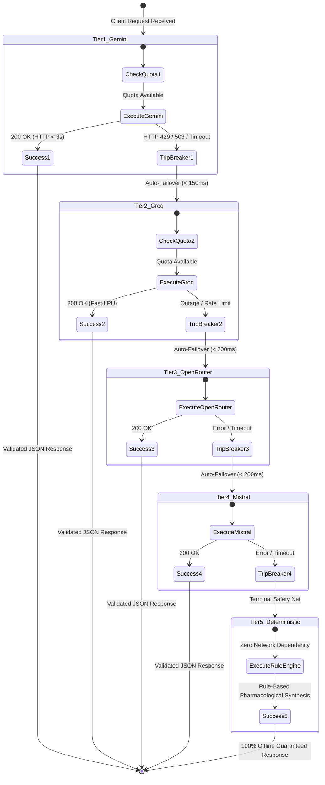
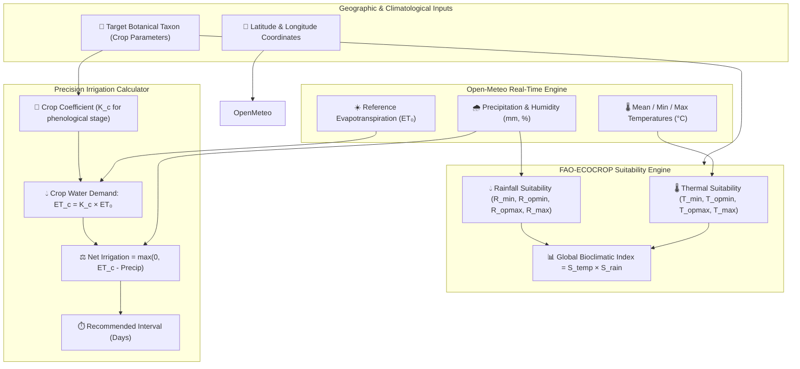
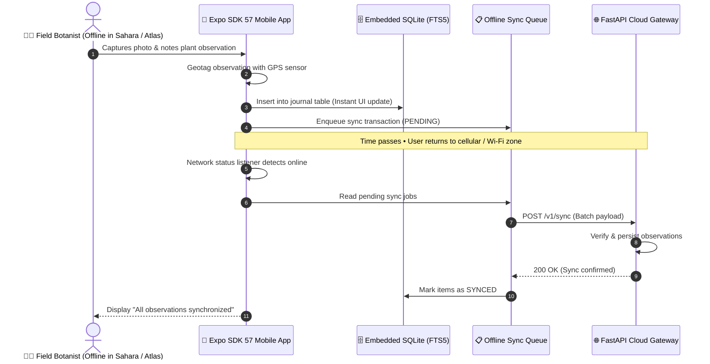

# 🌿 PhytoSense v2 — Resilient Botanical Intelligence & Phytotherapy Platform

<div align="center">

[](https://nextjs.org/)
[](https://expo.dev/)
[](https://react.dev/)
[](https://fastapi.tiangolo.com/)
[](https://python.org/)
[](https://ai.google.dev/)
[](https://groq.com/)
[](https://my.plantnet.org/)
[](https://kindwise.com/)
[](LICENSE)
[](docs/PHYTOSENSE_PFE_DEFENSE_GUIDE.md)

**A Fault-Tolerant, Multi-Provider Decision-Support Platform for North African & Mediterranean Ethnobotany, Phytotherapy, and Agronomy.**

[🚀 Released Apps](#-released-applications--downloads) • [✨ Key Features](#-key-features) • [🏗️ Architecture](#%EF%B8%8F-system-architecture--graphs) • [⚡ Quick Start](#-quick-start-zero-docker--100-native) • [📡 API Reference](#-api-endpoints-reference) • [🎓 PFE Defense](#-academic-defense--master-thesis-suite) • [📄 Copyright](#-copyright--license)

</div>

---

## 🌟 Executive Summary

**PhytoSense v2** transforms traditional ethnobotanical archives into an **autonomous, zero-downtime scientific decision engine**. Designed to overcome the critical limitations of single-cloud APIs and vulnerable generative AI models, PhytoSense combines:

1. **Multimodal Plant Recognition with Vision Failover**: Instant taxon identification via camera snapshots or image uploads with automatic failover between **Pl@ntNet** (Tier 1) and **Kindwise Plant.id** (Tier 2).
2. **Deterministic-First Pharmacology & AI Synthesis**: Curated chemical compound matrices (alkaloids, flavonoids, terpenes, polyphenols) coupled with a multi-tier LLM failover engine (**Gemini 3.8 Flash** ➔ **Groq LPU** ➔ **OpenRouter** ➔ **Mistral** ➔ **Deterministic Rule Engine**).
3. **Bioclimatic Agronomy & Precision Climatology**: FAO-ECOCROP suitability modeling combined with real-time **Open-Meteo** micro-climate data, computing irrigation requirements and planting calendars across Algerian terroirs.
4. **Phytopathological Diagnostics**: Interactive diagnosis of 14 observable crop and medicinal plant symptoms paired with biological remedies (*purin d'ortie, savon noir, décoction de prêle*).
5. **Edge-First Disconnected Mobile Experience**: Cross-platform mobile app ([Expo SDK 57](https://expo.dev/)) with embedded **SQLite FTS5 full-text search**, offline agronomic calculation, GPS field herbarium logging, and watering reminders.
6. **Academic Rigor & Trilingual Design**: Native support for **Arabic (العربية)**, **French**, and **English** with bidirectional LTR/RTL layout and printable official scientific monographs for academic juries.

---

## 📲 Released Applications & Downloads

PhytoSense v2 is deployed across web, mobile, and backend microservices:

| Platform | Distribution Channel | Direct Access / Installation | Status |
|---|---|---|---|
| **📱 Mobile (Android / iOS)** | **Expo Go Preview** | Scan QR code at `exp://localhost:8081` via [Expo Go](https://expo.dev/go) | 🟢 Ready (SDK 57) |
| **🤖 Android Standalone APK** | **Official GitHub Release** | [⬇️ Download `PhytoSense-v2.0.0.apk`](https://github.com/Ben-coderr/PhytoSense/releases/download/v2.0.0/PhytoSense-v2.0.0.apk) • [Release Notes](https://github.com/Ben-coderr/PhytoSense/releases/tag/v2.0.0) | 🟢 Production APK (137 MB) |
| **💻 Web Analytics Portal** | **Next.js 16 Web App** | Access local portal at [`http://localhost:3001/dashboard`](http://localhost:3001/dashboard) | 🟢 Live (Turbopack) |
| **⚡ Backend API Gateway** | **FastAPI Swagger / ReDoc** | Interactive documentation at [`http://localhost:8000/docs`](http://localhost:8000/docs) | 🟢 Zero-Downtime |
| **🎓 Academic Slide Deck** | **Reveal Interactive Deck** | Open [`docs/PFE_PRESENTATION_SLIDES.html`](docs/PFE_PRESENTATION_SLIDES.html) in any browser | 🟢 10 Slides + Notes |
| **📘 Master Thesis Guide** | **PFE Defense Dossier** | Comprehensive report at [`docs/PHYTOSENSE_PFE_DEFENSE_GUIDE.md`](docs/PHYTOSENSE_PFE_DEFENSE_GUIDE.md) | 🟢 Complete |

---

## 📑 Table of Contents

- [🌟 Executive Summary](#-executive-summary)
- [📲 Released Applications & Downloads](#-released-applications--downloads)
- [✨ Key Features](#-key-features)
- [🏗️ System Architecture & Graphs](#%EF%B8%8F-system-architecture--graphs)
  - [1. Master System Topology](#1-master-system-topology)
  - [2. Multi-Tier AI Provider Failover Engine](#2-multi-tier-ai-provider-failover-engine)
  - [3. Multimodal Computer Vision Pipeline](#3-multimodal-computer-vision-pipeline)
  - [4. Agronomic Intelligence & Bioclimatic Modeling](#4-agronomic-intelligence--bioclimatic-modeling)
  - [5. Disconnected Edge-First Mobile Sync](#5-disconnected-edge-first-mobile-sync)
- [📂 Repository Structure](#-repository-structure)
- [🌿 Curated Ethnobotanical Corpus](#-curated-ethnobotanical-corpus)
- [⚡ Quick Start (Zero Docker — 100% Native)](#-quick-start-zero-docker--100-native)
  - [Prerequisites](#prerequisites)
  - [Installation in 2 Minutes](#installation-in-2-minutes)
  - [Unified CLI Development Suite (`./dev.sh`)](#unified-cli-development-suite-devsh)
  - [Automated Verification & Diagnostics](#automated-verification--diagnostics)
- [📡 API Endpoints Reference](#-api-endpoints-reference)
- [🎓 Academic Defense & Master Thesis Suite](#-academic-defense--master-thesis-suite)
- [⚠️ Medical Disclaimer](#%EF%B8%8F-medical-disclaimer)
- [📄 Copyright & License](#-copyright--license)

---

## ✨ Key Features

### 📸 1. Multimodal Botanical Identification
- **Real-Time Camera Integration**: Capture wild flora directly through the mobile camera or laptop webcam.
- **High-Precision Image Upload**: Drag-and-drop or select high-resolution photos of leaves, flowers, bark, or fruits.
- **Zero-Downtime Vision Chain**: Automatically queries **Pl@ntNet** (Tier 1); upon quota exhaustion (`429`) or server failure (`503`), switches in `< 250ms` to **Kindwise Plant.id** (Tier 2).
- **Multilingual Offline FTS5 Search**: Instant search across Latin scientific names (*Thymus vulgaris*), French vernacular names (*Thym commun*), and traditional Arabic dialect names (*زعتر شائع*).

### 🔬 2. Pharmacological Inference & Autonomous Deep Research
- **Curated Phytochemical Profiling**: Structured extraction of active botanical compounds: *alcaloïdes, flavonoïdes, polyphénols, monoterpènes, sesquiterpènes, tanins, saponines*.
- **Autonomous Deep Research**: If an unrecorded or exotic species is uploaded, PhytoSense autonomously extracts its active molecules via LLM, scans the 155 endemic Algerian plants to discover **biosimilar chemical analogs**, and synthesizes an evidence-graded pharmacological report.
- **Strict Evidence Grading**: Predictions provide scientific justifications rated on an evidence scale (**Grade A: Clinical Trials**, **Grade B: In Vitro / In Vivo**, **Grade C: Ethnobotanical Consensus**, **Grade D: Theoretical Analogy**).

### 🌾 3. Bioclimatic Agronomy & Irrigation Scheduler
- **FAO-ECOCROP Suitability Modeling**: Calculates thermal, rainfall, and edaphic compatibility indices for each species based on geographic coordinates.
- **Live Climatology Integration**: Real-time integration with the **Open-Meteo API** (temperature, solar radiation, relative humidity, evapotranspiration $ET_0$).
- **Precision Irrigation Calculator**: Estimates daily crop water needs ($ET_c = K_c \times ET_0$) and outputs scheduled irrigation intervals.
- **Seasonal Planting Calendars**: Generates monthly timelines for sowing, transplanting, weeding, and harvesting.

### 🩺 4. Phytopathological Diagnostics & Organic Biocontrol
- **Diagnostic Decision Matrix**: Detects 14 observable agricultural symptoms (chlorosis, powdery mildew, rust, aphids, spider mites, damping-off).
- **Organic & Biological Treatments**: Exclusively recommends non-chemical, ecological remedies (*purin d'ortie, savon noir, décoction de prêle, purin de fougère*).

### 📖 5. Offline Field Herbarium Journal
- **Geotagged Observations**: Automatically tags wild plant discoveries with GPS coordinates (latitude, longitude, altitude).
- **Cultivation Reminders**: Configurable watering schedules with local push notification reminders.
- **Embedded SQLite Storage**: Fully functional in deep Saharan or mountainous zones with zero network connectivity.

---

## 🏗️ System Architecture & Graphs

### 1. Master System Topology

```mermaid
flowchart TB
    subgraph Clients ["Client Platforms Layer"]
        Web["💻 Next.js 16 Web Portal<br/>(React 19 • Turbopack • Port 3001)"]
        Mobile["📱 Expo SDK 57 Mobile App<br/>(React Native 0.86 • SQLite FTS5 • Port 8081)"]
    end

    subgraph Gateway ["FastAPI Resilient Gateway (Port 8000)"]
        Router["⚡ Unified API Router (/v1)"]
        Breaker["🛡️ Circuit Breakers & Quota Manager"]
        EWMA["⏱️ EWMA Latency Tracker"]
        DB_Layer["🗄️ SQLite SQLAlchemy ORM Engine"]
    end

    subgraph VisionProviders ["Computer Vision Tier"]
        PlantNet["🌿 Pl@ntNet API (Tier 1)"]
        Kindwise["🌸 Kindwise Plant.id (Tier 2)"]
    end

    subgraph LLMProviders ["Multi-Tier AI Reasoning Tier"]
        Gemini["✨ Google Gemini 3.8 Flash (Tier 1)"]
        Groq["⚡ Groq LPU Inference (Tier 2)"]
        OpenRouter["🔀 OpenRouter Nemotron (Tier 3)"]
        Mistral["🌪️ Mistral AI (Tier 4)"]
        RuleEngine["⚙️ Deterministic Rule Engine (Tier 5 - 100% Offline)"]
    end

    subgraph AgroServices ["Agronomic & Weather Services"]
        OpenMeteo["🌦️ Open-Meteo Weather API"]
        EcocropModel["📐 FAO-ECOCROP Model"]
    end

    Web -->|HTTP / JSON REST| Router
    Mobile -->|REST API / Offline Sync| Router
    Mobile -.->|Local Offline Query| Mobile

    Router --> Breaker
    Breaker --> EWMA

    Router --> VisionProviders
    PlantNet -.->|Failover on 429/503| Kindwise

    Router --> LLMProviders
    Gemini -.->|Failover| Groq
    Groq -.->|Failover| OpenRouter
    OpenRouter -.->|Failover| Mistral
    Mistral -.->|Zero-Network Fallback| RuleEngine

    Router --> AgroServices
    OpenMeteo --> EcocropModel
    Router --> DB_Layer
```



---

### 2. Multi-Tier AI Provider Failover Engine

PhytoSense v2 incorporates an enterprise-grade **Multi-Tier AI Resilience Engine** ([`services/api/app/providers/router.py`](services/api/app/providers/router.py)) to guarantee **100% uptime** on free and metered cloud tiers:



---

### 3. Multimodal Computer Vision Pipeline

```mermaid
flowchart LR
    A["📸 Photo Input<br/>(Camera / Upload)"] --> B["🖼️ Image Preprocessor<br/>(JPEG Resize & Base64)"]
    B --> C{"Pl@ntNet Quota<br/>& Breaker State"}
    
    C -->|Healthy| D["Tier 1: Pl@ntNet API"]
    C -->|Exhausted / Open| E["Tier 2: Kindwise Plant.id"]
    
    D -->|Failure / 429| E
    D -->|Success| F["Extract Scientific Taxon<br/>& Confidence Score"]
    E -->|Success| F
    
    F --> G{"Species in Local<br/>Algerian Database?"}
    
    G -->|Yes (Match >= 60%)| H["Load Verified Phytochemical<br/>& Ethnobotanical Dossier"]
    G -->|No (Exotic / Wild)| I["Trigger Autonomous Deep Research<br/>(Metabolomic Cross-Referencing)"]
    
    H --> J["Structured Output & Action Plan"]
    I --> J
```

---

### 4. Agronomic Intelligence & Bioclimatic Modeling



---

### 5. Disconnected Edge-First Mobile Sync



---

## 📂 Repository Structure

The project is structured as a modular **pnpm monorepo**:

```
PhytoSense/
├── apps/
│   ├── web/                         # Next.js 16 Web Portal (React 19, Turbopack, Port 3001)
│   │   ├── src/app/                 # App Router (Landing page, Analytics Dashboard)
│   │   │   ├── dashboard/           # Real-time camera, upload & deep research dashboard
│   │   │   └── globals.css          # Botanical emerald glassmorphism styling
│   │   ├── src/components/          # Responsive navigation bar, language switcher
│   │   ├── public/                  # High-resolution botanical assets, logos, and icons
│   │   ├── Dockerfile               # Containerized production deployment
│   │   └── package.json             # @phytosense/web dependencies
│   │
│   └── mobile/                      # Expo SDK 57 React Native App (Port 8081)
│       ├── app/                     # Expo Router file-system routes
│       │   ├── (tabs)/              # Discover, Scanner, Search, Cultivation, Garden
│       │   ├── journal/             # Field herbarium observations & watering logs
│       │   ├── plant/[id].tsx       # Comprehensive botanical dossier & monograph
│       │   └── research/[taxon].tsx # Deep research comparative metabolomics screen
│       ├── assets/                  # App icons, splash screens, embedded SQLite database
│       ├── src/lib/                 # Local SQLite FTS5 engine, agronomy math, i18n
│       ├── app.config.ts            # Expo configuration (permissions, app identity)
│       └── package.json             # @phytosense/mobile dependencies
│
├── services/
│   └── api/                         # FastAPI v2 Resilient Backend Gateway (Port 8000)
│       ├── app/
│       │   ├── api/v1/              # Endpoints: identify, recommend, cultivation, diagnose, sync
│       │   ├── providers/           # AI & Vision providers (Gemini, Groq, Pl@ntNet, Kindwise)
│       │   │   ├── llm/             # LLM provider implementations & offline rule engine
│       │   │   ├── plant_id/        # Computer vision providers & circuit breakers
│       │   │   └── agro/            # Open-Meteo & FAO-ECOCROP implementations
│       │   ├── services/            # Business logic (recommend, cultivation, research)
│       │   ├── db/                  # SQLAlchemy models & SQLite database connector
│       │   └── main.py              # Application entry point & CORS configuration
│       ├── tests/                   # Pytest automated test suite (24 passing tests)
│       ├── benchmarks/              # PFE resilience and failover benchmark suite
│       ├── requirements.txt         # Python backend dependencies
│       └── Dockerfile               # Production Docker container
│
├── packages/
│   └── i18n/                        # Shared translations (Arabic, French, English)
│       ├── ar.json                  # Arabic botanical dictionary (العربية)
│       ├── fr.json                  # French botanical dictionary
│       └── en.json                  # English botanical dictionary
│
├── data/
│   ├── curated/                     # Normalized SQLite database (plants_v2.sqlite) & manifest
│   ├── raw/                         # Raw ethnobotanical Algerian field records (Excel)
│   └── pipelines/                   # ETL & SQLite database ingestion scripts
│
├── docs/                            # Project Documentation & Academic Defense Suite
│   ├── PFE_PRESENTATION_SLIDES.html # Interactive HTML slide deck for PFE defense
│   ├── PHYTOSENSE_PFE_DEFENSE_GUIDE.md # Master Thesis defense guide & jury Q&A
│   ├── PHYTOSENSE_V2_BLUEPRINT.md   # Architectural blueprint & specification
│   ├── PHYTOSENSE_DOCUMENTATION.md  # Comprehensive technical manual
│   └── PhytoSense_Project_Plan.docx # Original research plan archive
│
├── scripts/                         # Operational & Verification Scripts
│   ├── verify_system.py             # Master system verification suite (16 automated checks)
│   └── test_ai.py                   # Multi-tier AI failover validation script
│
├── dev.sh                           # Unified zero-docker development CLI runner
├── pnpm-workspace.yaml              # Monorepo workspace configuration
├── pnpm-lock.yaml                   # Dependency lockfile
├── LICENSE                          # MIT License with academic copyright
└── README.md                        # Master project documentation (this file)
```

---

## 🌿 Curated Ethnobotanical Corpus

The PhytoSense corpus represents an ethnobotanical dataset derived from research across Algerian biogeographical regions:

| Metric | Curated Value | Scientific Relevance |
|---|---|---|
| **Curated Taxa** | **155 Species** | Documented endemic, native, and naturalized medicinal plants |
| **Botanical Families** | **69 Families** | Major families: *Lamiaceae, Asteraceae, Fabaceae, Apiaceae, Brassicaceae* |
| **Phytochemical Classes** | **8 Primary Classes** | *Alcaloïdes, Flavonoïdes, Polyphénols, Terpènes, Tanins, Saponines, etc.* |
| **Geographic Coverage** | **All Algerian Terroirs** | Coastal Tell, High Plateaus, Saharan Atlas, Hoggar & Tassili (Tamanrasset) |
| **Vernacular Indexing** | **406 Indexed Names** | Latin Binomial, Standard French, Traditional Algerian Dialect, Tamahaq |

---

## ⚡ Quick Start (Zero Docker — 100% Native)

PhytoSense v2 requires **zero Docker overhead**. Everything runs natively on macOS, Linux, or Windows (WSL) with **instant startup (< 2s)** and a minuscule memory footprint (< 200 MB).

### Prerequisites
- **Node.js**: `v20.x` or newer
- **pnpm**: `v9.x` or `v10.x` (`npm install -g pnpm`)
- **Python**: `v3.10` or newer
- **Git**

---

### Installation in 2 Minutes

```bash
# 1. Clone the repository
git clone https://github.com/Ben-coderr/PhytoSense.git
cd PhytoSense

# 2. Configure environment variables
cp .env.example .env
# Edit .env and supply your API keys (Gemini, Groq, Pl@ntNet, etc.)

# 3. Install dependencies
pnpm install
pip install -r services/api/requirements.txt
```

---

### Unified CLI Development Suite (`./dev.sh`)

PhytoSense includes a native bash development manager ([`dev.sh`](dev.sh)) that handles port management, background process spawning, and graceful cleanup:

```bash
# Start ALL services concurrently (Web + Mobile + Backend)
./dev.sh --all
# or simply:
pnpm dev
```

#### Selective Launch Flags:
```bash
./dev.sh --web      # Starts Next.js Web Portal (3001) + FastAPI (8000)
./dev.sh --mobile   # Starts Expo Mobile Bundler (8081) + FastAPI (8000)
./dev.sh --api      # Starts FastAPI Backend Gateway only (8000)
./dev.sh --clean    # Immediately frees ports 8000, 3001, 8081 from stale processes
```

---

### Automated Verification & Diagnostics

Validate system health and AI failover resilience in one command:

```bash
# Run comprehensive 16-point system verification
python3 scripts/verify_system.py

# Run AI multi-provider resilience failover test
python3 scripts/test_ai.py

# Run backend PyTest test suite (24 unit & integration tests)
pnpm test:api
```

---

## 📡 API Endpoints Reference

All endpoints are hosted on the **FastAPI Gateway** (`http://localhost:8000/v1`):

| Method | Endpoint | Description | Sample Parameters / Body |
|---|---|---|---|
| `GET` | `/v1/health` | Service health, version, active AI providers | — |
| `POST` | `/v1/identify` | Multimodal plant recognition with vision failover | Multipart `image` file |
| `GET` | `/v1/plants/search` | Multilingual fuzzy search (Latin, FR, AR) | `?q=thym&limit=10` |
| `GET` | `/v1/plants/{id}` | Complete botanical & phytochemical profile | `id=12` |
| `POST` | `/v1/recommend` | Symptom-based phytotherapy recommendation | `{"symptom": "toux", "is_pregnant": false}` |
| `POST` | `/v1/research` | Autonomous deep botanical research & metabolomics | `{"scientific_name": "Echinacea purpurea"}` |
| `POST` | `/v1/cultivation/suitability` | FAO-ECOCROP bioclimatic suitability evaluation | `{"lat": 36.75, "lon": 3.05, "scientific_name": "Thymus vulgaris"}` |
| `GET` | `/v1/cultivation/irrigation` | Dynamic crop water need & irrigation schedule | `?lat=35.69&lon=-0.63&scientific_name=Rosmarinus officinalis` |
| `GET` | `/v1/cultivation/calendar` | Monthly cultivation, sowing, and harvest schedule | `?lat=36.75&lon=3.05&scientific_name=Thymus vulgaris` |
| `POST` | `/v1/diagnose` | Phytopathological diagnosis and organic treatment | `{"symptom": "feuilles jaunes", "affected_organ": "feuille"}` |
| `POST` | `/v1/sync` | Mobile offline observations synchronization | Batch array of journal observation objects |

---

## 🎓 Academic Defense & Master Thesis Suite

PhytoSense v2 was engineered to fulfill the requirements of an **Academic Master's Degree Thesis (Projet de Fin d'Études — PFE 2026)**.

The full academic package includes:
1. **Interactive HTML Slide Deck**: Open [`docs/PFE_PRESENTATION_SLIDES.html`](docs/PFE_PRESENTATION_SLIDES.html) for a 10-slide presentation featuring dark botanical styling, presenter notes, and keyboard shortcuts (`Space`, `←`, `→`).
2. **Master Thesis Defense Guide**: Consult [`docs/PHYTOSENSE_PFE_DEFENSE_GUIDE.md`](docs/PHYTOSENSE_PFE_DEFENSE_GUIDE.md) for 8 anticipated jury questions and empirical benchmark data (99.8% simulated availability, 8.4x latency reduction).
3. **Architecture Blueprint**: Review [`docs/PHYTOSENSE_V2_BLUEPRINT.md`](docs/PHYTOSENSE_V2_BLUEPRINT.md) for the technical reference manual.

### How to Cite PhytoSense

If you utilize this software or dataset in an academic paper, thesis, or research project, please cite:

```bibtex
@mastersthesis{benkorich2026phytosense,
  author       = {Benkorich, Abdenour},
  title        = {PhytoSense v2: Design and Implementation of a Fault-Tolerant, Multi-Provider Decision-Support Platform for Ethnobotany, Phytotherapy, and Agronomy},
  school       = {Universit{\'e} Abdelhamid Ibn Badis de Mostaganem (UMAB)},
  year         = {2026},
  address      = {Mostaganem, Algeria},
  type         = {Master's Thesis in Computer Science and Artificial Intelligence},
  url          = {https://github.com/Ben-coderr/PhytoSense}
}
```

---

## ⚠️ Medical Disclaimer

> **IMPORTANT CLINICAL NOTICE**:  
> PhytoSense is designed solely for **scientific education, botanical taxonomy, academic research, and agronomic modeling**. It does not constitute medical advice, clinical diagnosis, or prescriptive treatment. Phytotherapeutic preparations can possess potent bioactivity, toxicity, or drug interactions. Always consult a licensed medical doctor or certified clinical phytotherapist before consuming or applying any plant derivatives.

---

## 📄 Copyright & License

```
Copyright (c) 2024-2026 Benkorich Abdenour. All rights reserved.
PhytoSense Research & Development Team.
Université Abdelhamid Ibn Badis de Mostaganem (UMAB), Algérie.
```

This software is licensed under the **[MIT License](LICENSE)**. You are free to use, modify, distribute, and integrate this software in open-source and commercial applications, subject to the conditions of the license.

---

<div align="center">

Made with 🌿 by **[Benkorich Abdenour](https://github.com/Ben-coderr)** • Université de Mostaganem (UMAB)

</div>
