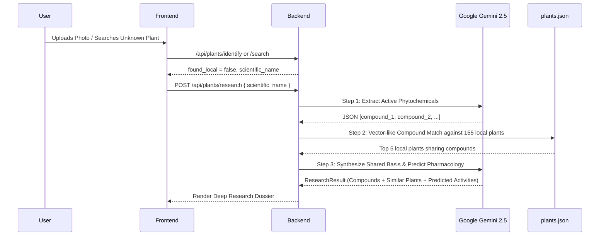

# 📖 PhytoSense: Complete Technical Specification & Comprehensive Documentation

---

## 📌 Executive Summary

**PhytoSense** is a full-stack, AI-augmented botanical research platform specifically engineered to bridge traditional ethnobotanical knowledge with modern computational pharmacology. 

The platform allows users to:
1. **Identify medicinal plants** using high-resolution visual recognition (via live camera or image uploads) or multilingual search across vernacular and scientific taxonomy.
2. **Access structured phytochemical profiles** (active components, alkaloids, flavonoids, terpenes, plant organs used, harvest regions, and documented therapeutic uses) grounded in a curated corpus of 155 Algerian and North African medicinal plants.
3. **Generate hypothetical pharmacological predictions** using Google Gemini 2.5 Flash, synthesizing known chemical structures into probable biological targets and actions.
4. **Conduct autonomous Deep Research on unrecorded/exotic plants**, extracting active chemical constituents and algorithmically cross-referencing them against the local botanical database to discover chemical analogues and shared therapeutic pathways.

---

## 1. Project Genesis & Academic Context

### 1.1 The Problem Statement
Traditional herbal medicine and ethnopharmacology hold vital solutions for modern drug discovery. However:
- **Data Fragmentation**: Regional botanical studies are often locked away in static academic papers, thesis archives, or unstructured spreadsheets.
- **Identification Barrier**: Laypersons, students, and field researchers struggle to bridge field specimens with scientific monographs.
- **Under-characterized Therapeutics**: Documented folk usage often lacks biochemical justifications, while modern chemical literature is disconnected from regional plant catalogs.

### 1.2 Academic Framework (PFE)
PhytoSense was conceived as a university **Projet de Fin d'Études (PFE)**. The original prompt arose from an academic dataset of Algerian medicinal plants compiled from university field studies. The objective was to evolve this static dataset into an interactive, cloud-ready, and scientifically honest web platform with an AI-driven predictive layer.

---

## 2. Data Engineering & Source Corpus

### 2.1 The Raw Dataset (`tableau 2...xlsx`)
The primary asset was an unstructured Excel spreadsheet containing 157 raw rows (representing 156 unique botanical taxa after deduplication).

#### Audit of Raw Columns:
1. **Nom en Arabe**: Arabic vernacular name, often containing dialectal notes (Darja, Tamahaq), regional phonetic spellings, and explanatory text (e.g. *\"Elsinouj\" en Algérie*, *En tamahaq : Tadent*).
2. **Nom en Français**: French common names, frequently combined with French botanical synonyms or descriptions.
3. **Nom Scientifique**: Latin binomial or trinomial nomenclature (e.g., *Nigella sativa L.*, *Calobota saharae*).
4. **Région**: Geographic collection sites within Algeria (e.g., *Sétif, Biskra, Béchar, Tamanrasset, Hauts Plateaux*).
5. **Partie Utilisée**: Specific anatomical parts harvested (e.g., *graines, feuilles, racines, sommités fleuries, écorce, huile essentielle*).
6. **Composition Chimique**: Descriptive free text detailing extracted metabolites, percentages, and chemical families.
7. **Activité Biologique**: Documented medicinal actions from traditional use and published laboratory assays.
8. **Famille**: Botanical taxonomic family (e.g., *Lamiaceae, Asteraceae, Fabaceae*).
9. **Auteur**: Academic citations, researchers, and scientific publications responsible for the data.

### 2.2 Data Cleaning Pipeline (`data_cleaner.py`)
To make this data queryable and suitable for algorithmic consumption, [`data_cleaner.py`](file:///Users/mac/Downloads/Compressed/PhytoSense-main/data_cleaner.py) applies the following transformations:

1. **Junk Removal & Standardization**: Cleans null placeholders, punctuation chains (e.g., `///////`), and excessive whitespace.
2. **Taxonomic Deduplication**: Resolves duplicate entries (such as *Calobota saharae*) by aggregating observation texts using line breaks while retaining unique regional occurrences.
3. **Vernacular Name Parsing (`split_name`)**: Separates actual common names from descriptive commentary and language tags, storing explanations in `arabic_notes` and `french_notes`.
4. **Phytochemical & Activity Tag Extraction**:
   - **Composition Tags**: Scans free-text descriptions against chemical keywords (`alcaloïde`, `flavonoïde`, `polyphénol`, `terpène`, `monoterpène`, `sesquiterpène`, `tanin`, `saponine`, `coumarine`, `huile essentielle`, `protéine`, `acide`, `vitamine`).
   - **Activity Tags**: Scans biological activity text against pharmacological keywords (`antioxydant`, `antibactérien`, `antimicrobien`, `antifongique`, `anti-inflammatoire`, `antidiabétique`, `anticancéreux`, `antitumoral`, `analgésique`, `antispasmodique`, `cicatrisant`, `diurétique`).
5. **Dual Storage Export**:
   - `plants.json`: Fully structured JSON file (tags as native arrays) for rapid file-based lookups and cross-referencing.
   - `plants.db`: SQLite relational database (via SQLAlchemy schema) with primary keys and indexed search columns.

```
Raw Excel (.xlsx) 
   ──> Pandas DataFrame 
   ──> RegEx Cleaners 
   ──> Tag Extractors 
   ──> plants.json (155 entries) & plants.db (SQLite)
```

---

## 3. System Architecture & Component Design

The platform uses a modern decoupled architecture where Next.js acts as the presentation layer and FastAPI acts as the computational and AI orchestration engine.

```
                                  ┌───────────────────────────────┐
                                  │      Client Web Browser       │
                                  │ (Next.js 16 / React 19 / CSS) │
                                  └───────────────┬───────────────┘
                                                  │
                                         REST API │ (HTTP / JSON)
                                                  ▼
                                  ┌───────────────────────────────┐
                                  │     FastAPI Backend (ASGI)    │
                                  │        Port 8000 / Vercel     │
                                  └───────┬───────┬───────┬───────┘
                                          │       │       │
                     ┌────────────────────┘       │       └───────────────────┐
                     ▼                            ▼                           ▼
          ┌──────────────────────┐    ┌──────────────────────┐    ┌──────────────────────┐
          │  Fuzzy & Relational  │    │   Computer Vision    │    │  Generative AI Core  │
          │    Database Engine   │    │    Pl@ntNet API      │    │  Google Gemini 2.5   │
          │ (SQLite + RapidFuzz) │    │  (Leaf/Flower Recog) │    │ (Predict & Research) │
          └──────────────────────┘    └──────────────────────┘    └──────────────────────┘
```

### 3.1 Routing & Proxy Integration
- In **development**, Next.js proxies API calls via `next.config.ts`:
  ```typescript
  { source: "/api/:path*", destination: "http://127.0.0.1:8000/api/:path*" }
  ```
- In **production** on Vercel, `vercel.json` routes `/api/(.*)` to `/api/index.py` using Python Serverless Runtimes.

---

## 4. Subsystems Deep-Dive

### 4.1 Subsystem 1: Search & Matching Engine
- **Source**: [`api/routers/plants.py`](file:///Users/mac/Downloads/Compressed/PhytoSense-main/api/routers/plants.py)
- **Algorithm**: `RapidFuzz` string similarity using the **Weighted Ratio (`WRatio`)** metric.
- **Workflow**:
  1. The user inputs a query `q` (minimum 2 characters).
  2. The router retrieves records and constructs a candidate list per plant: `[scientific_name, french_name, arabic_name]`.
  3. `process.extractOne(q, valid_names, scorer=fuzz.WRatio)` calculates the similarity score.
  4. Matches scoring **≥ 60.0%** are retained and sorted descending by similarity score.
  5. If no records match the 60% threshold, the API returns:
     ```json
     {
       "found_local": false,
       "scientific_name": "Query",
       "message": "Plant not found in local database. Deep research required."
     }
     ```
     This triggers the autonomous Deep Research flow on the client!

---

### 4.2 Subsystem 2: Computer Vision Plant Recognition
- **Source**: [`api/services/plantnet_service.py`](file:///Users/mac/Downloads/Compressed/PhytoSense-main/api/services/plantnet_service.py)
- **Service**: Pl@ntNet API v2 (`https://my-api.plantnet.org/v2/identify/all`).
- **Workflow**:
  1. User snaps a picture with their webcam/phone camera via HTML5 WebRTC (`navigator.mediaDevices.getUserMedia`) or selects an image file.
  2. The image blob is uploaded via `POST /api/plants/identify` as `multipart/form-data`.
  3. The backend sends the image buffer asynchronously via `httpx` to Pl@ntNet.
  4. The response extracts top candidate species (`scientificNameWithoutAuthor`).
  5. The backend cross-references the Pl@ntNet candidates against the local SQLite database using `RapidFuzz` (score threshold ≥ 70.0%).
  6. If a local match is found, the verified profile is served. If not found locally, the top identified scientific name is returned with `found_local: false`, triggering Deep Research.

---

### 4.3 Subsystem 3: AI Pharmacology Prediction Engine
- **Source**: [`api/services/ai_service.py`](file:///Users/mac/Downloads/Compressed/PhytoSense-main/api/services/ai_service.py)
- **Model**: `gemini-2.5-flash` via the official `google-genai` SDK.
- **Schema Validation**:
  ```python
  class PredictionResult(BaseModel):
      predicted_activities: list[str] = Field(description="List of predicted therapeutic activities based on the chemical compounds.")
      reasoning: str = Field(description="A brief explanation of why these activities were predicted.")
  ```
- **Prompt Architecture**:
  The model acts as an expert phytochemist and pharmacologist. Given the verified composition tags and detailed extraction text, it reasons about structure-activity relationships (e.g., presence of *thymoquinone* -> antioxidant, anti-inflammatory, neuroprotective; presence of *sesquiterpene lactones* -> antimicrobial, cytotoxic).
- **Configuration**:
  - `response_mime_type="application/json"`
  - `response_schema=PredictionResult`
  - `temperature=0.2` (low temperature to minimize hallucination and prioritize chemical accuracy).

---

### 4.4 Subsystem 4: Autonomous Deep Research & Cross-Referencing
When a specimen is not present in the curated Algerian dataset, PhytoSense activates its two-step Deep Research pipeline:



#### Detailed Breakdown of Deep Research Steps:
1. **Step 1: Chemical Compound Mining**:
   Gemini is prompted to identify the known primary active secondary metabolites (alkaloids, flavonoids, terpenes, glycosides, phenolic acids) of the taxon.
2. **Step 2: Local Dataset Intersection**:
   The engine iterates through `plants.json`, matching extracted compounds against each local plant's `composition` and `composition_tags`. Plants are scored based on overlap and the top 5 highest-scoring matches are selected.
3. **Step 3: Pharmacological Synthesis**:
   Gemini receives the unknown plant, its discovered compounds, and the top 5 local matching plants (including their documented biological activity). It produces a unified `ResearchResult`:
   - `scientific_name`: Botanical identifier
   - `region`: Global indigenous habitat
   - `researched_compounds`: Discovered chemical entities
   - `similar_local_plants`: Array of matched local species, shared compounds, and chemical match rationales
   - `predicted_activities`: Inferred therapeutic uses

---

## 5. Frontend & UI/UX Architecture

### 5.1 Technology & Layout
- **Next.js 16 App Router**: Server and Client Components optimized for speed and SEO.
- **Framer Motion**: Smooth entrance animations for hero elements, bento grids, and result cards.
- **WebRTC Camera Capture**: Built-in camera modal for immediate field identification without requiring native app store downloads.

### 5.2 Trilingual Internationalization (i18n) & RTL
Located in [`src/i18n/`](file:///Users/mac/Downloads/Compressed/PhytoSense-main/src/i18n/), the custom translation engine supports:
- **English (`en`)**: LTR layout
- **Français (`fr`)**: LTR layout
- **العربية (`ar`)**: Full **RTL layout** (`dir="rtl"`, mirrored icons, flipped navigation controls, right-aligned forms).

Translations cover every interactive string across the landing page, search bar, camera controls, taxonomy cards, AI analysis warnings, and error messages.

---

## 6. Complete API Reference

### 6.1 `GET /api/plants/search`
- **Parameters**: `q` (string, required, min length 2)
- **Response (Found)**:
  ```json
  {
    "found_local": true,
    "results": [
      {
        "id": 1,
        "scientific_name": "Nigella sativa L.",
        "french_name": "nigrum",
        "arabic_name": "Elsinouj",
        "family": "Ranunculaceae",
        "region": "marché local de Sétif",
        "composition_tags": "polyphénol, flavonoïde, terpène",
        "similarity_score": 95.0
      }
    ]
  }
  ```
- **Response (Not Found)**:
  ```json
  {
    "found_local": false,
    "scientific_name": "Echinacea purpurea",
    "message": "Plant not found in local database. Deep research required."
  }
  ```

### 6.2 `GET /api/plants/{id}`
- **Parameters**: `id` (integer path parameter)
- **Response**: Full `PlantResponse` model containing taxonomy, composition, notes, and citations.

### 6.3 `GET /api/plants/{id}/predict`
- **Parameters**: `id` (integer path parameter)
- **Response**:
  ```json
  {
    "predicted_activities": [
      "Puissant antioxydant",
      "Anti-inflammatoire systémique",
      "Hépatoprotecteur"
    ],
    "reasoning": "La concentration élevée en thymoquinone et en polyphénols confère à cette espèce une capacité marquée à inhiber la lipoperoxydation et à moduler les cytokines pro-inflammatoires."
  }
  ```

### 6.4 `POST /api/plants/identify`
- **Body**: `multipart/form-data` with `image` (binary file)
- **Response**: Matches against Pl@ntNet and resolves against local database.

### 6.5 `POST /api/plants/research`
- **Body**:
  ```json
  {
    "scientific_name": "Rosmarinus officinalis"
  }
  ```
- **Response**:
  ```json
  {
    "scientific_name": "Rosmarinus officinalis",
    "region": "Bassin Méditerranéen",
    "researched_compounds": ["acide carnosique", "carnosol", "acide rosmarinique"],
    "similar_local_plants": [
      {
        "name": "Salvia officinalis L.",
        "shared_compounds": ["acide rosmarinique", "carnosol"],
        "match_reason": "Appartiennent tous deux à la famille des Lamiacées et partagent des diterpènes phénoliques protecteurs."
      }
    ],
    "predicted_activities": ["Antioxydant majeur", "Neuroprotecteur", "Antimicrobien"]
  }
  ```

---

## 7. Deployment & Operations

### 7.1 Production Deployment on Vercel
PhytoSense is architected for zero-configuration monorepo deployment on Vercel:
1. `vercel.json` routes `/api/(.*)` to `/api/index.py`.
2. Vercel automatically creates Python serverless functions for FastAPI.
3. Next.js static and server assets are hosted on Vercel's global edge network.

### 7.2 Containerized / VPS Deployment
For Docker, Render, or Railway:
1. **Dockerfile (Backend)**:
   ```dockerfile
   FROM python:3.11-slim
   WORKDIR /app
   COPY requirements.txt .
   RUN pip install --no-cache-dir -r requirements.txt
   COPY . .
   CMD ["uvicorn", "api.main:app", "--host", "0.0.0.0", "--port", "8000"]
   ```
2. **Dockerfile (Frontend)**:
   Standard Next.js multi-stage build (`npm run build && npm run start`).

---

## 8. Academic Jury Defense Guide (PFE Preparation)

| Question | Recommended Scientific Response |
|---|---|
| *Why use Pl@ntNet instead of training your own CNN?* | A proprietary model trained on 155 plants with only dozens of images would suffer severe overfitting and poor generalization in real-world lighting. Pl@ntNet provides a battle-tested model trained on millions of botanical specimens across global herbaria. Our innovation lies in the downstream integration: parsing Pl@ntNet results, cross-referencing regional Algerian flora, and executing neural pharmacological predictions. |
| *Can the AI predictions be trusted medically?* | No, and the system explicitly prevents misinterpretation. The predictions are formulated as computational hypotheses grounded in known structure-activity relationships (QSSR/pharmacophore reasoning), accompanied by mandatory disclaimers. |
| *How does PhytoSense handle dialectal name ambiguity in Algeria?* | The `RapidFuzz` layer searches across Arabic, French, and Latin binomials simultaneously. Vernacular dialect markers (*Tamahaq*, *Darja*) are preserved in metadata notes rather than discarded, accommodating regional linguistic diversity. |
| *What happens when a user submits an arbitrary non-plant image?* | Pl@ntNet returns a low confidence threshold or rejects non-plant imagery, triggering an informative error message instructing the user to supply clear photos of leaves, bark, or flowers. |

---

## 9. Future Roadmap & Expansion

1. **Massive Ethnobotanical Expansion**: Ingest wider North African, Saharan, and Mediterranean herbarium databases.
2. **Spectroscopic Data Ingestion**: Allow ingestion of GC-MS (Gas Chromatography-Mass Spectrometry) peak data for automated chemical profiling.
3. **PWA & Offline Edge AI**: Implement quantized on-device TensorFlow Lite / ONNX models for botanical identification in remote Saharan zones lacking internet connectivity.
4. **Interactive 3D Molecular Viewer**: Render 3D chemical structures for discovered molecules (e.g. *thymoquinone, carnosic acid*) directly within the browser using Three.js / Mol*.

---

*Authored for the PhytoSense Engineering & Research Team.*
